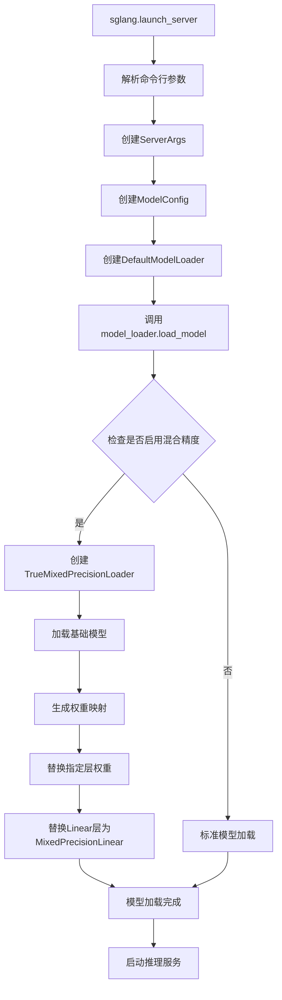
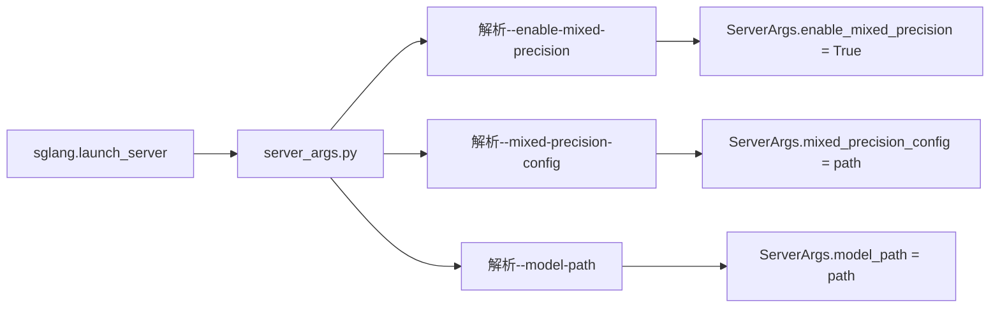
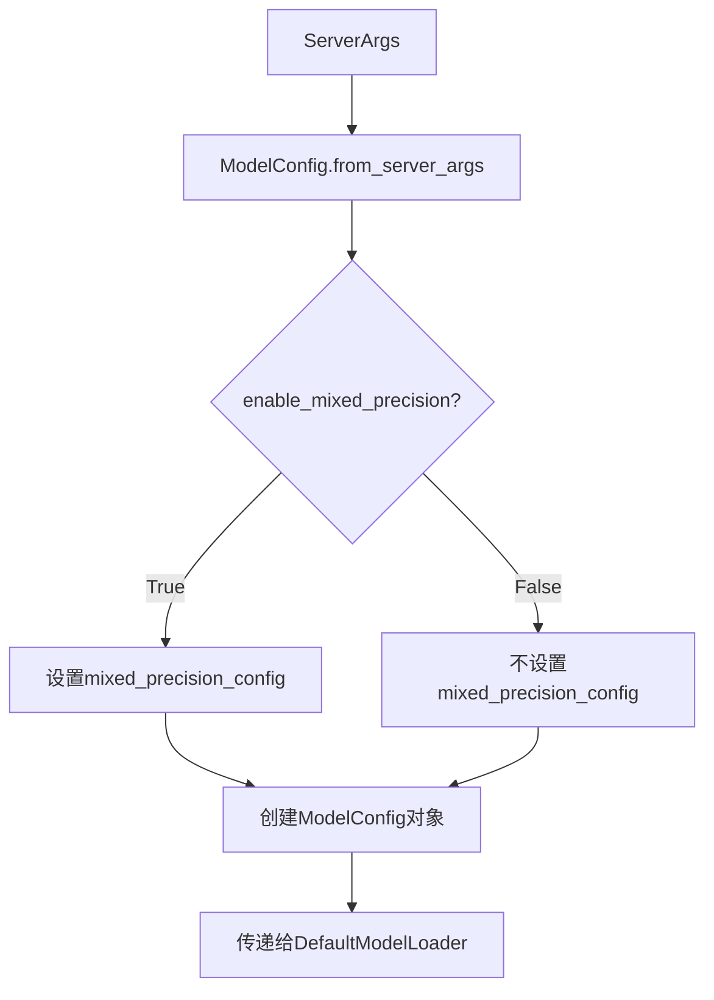
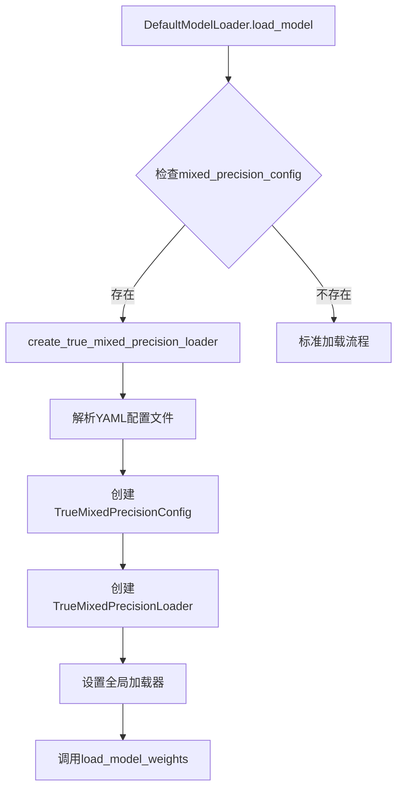
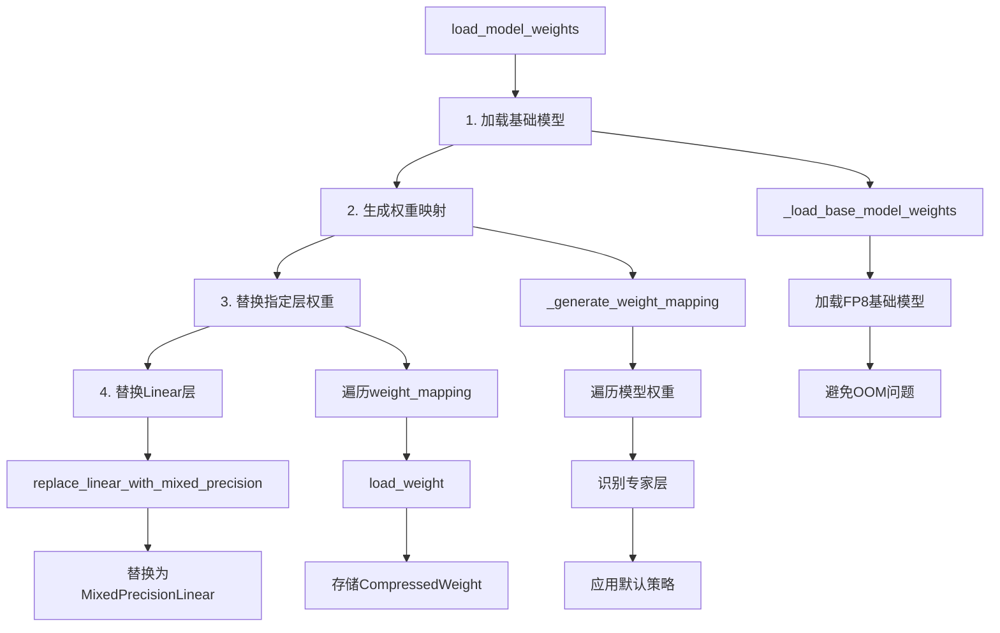
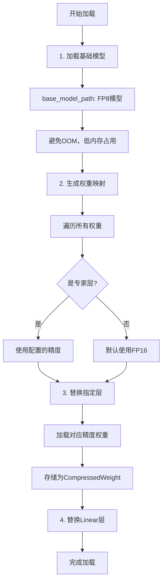
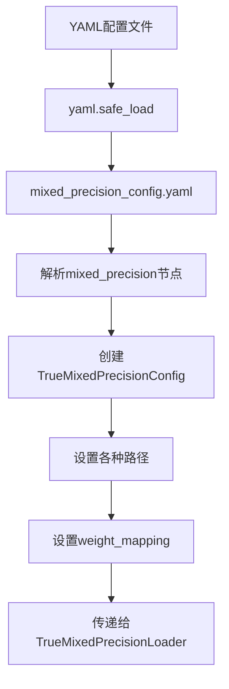
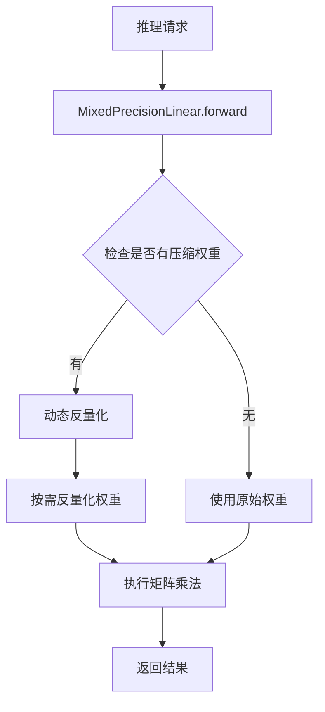

# 混合量化调用流程图

## 整体调用流程



## 详细调用流程

### 1. 启动入口
```bash
python3 -m sglang.launch_server \
  --model-path /dcar-vepfs-trans-models/Qwen3-30B-A3B-FP8 \
  --enable-mixed-precision \
  --mixed-precision-config ./mixed_precision_config.yaml \
  --tp-size 4 --dp-size 2 \
  --dtype bfloat16
```

### 2. 参数解析流程



### 3. 模型配置创建



### 4. 混合精度加载器创建



### 5. 模型权重加载流程



## 不同精度模型加载顺序

### 加载顺序详解



### 具体加载步骤

#### 步骤1: 基础模型加载
```
文件: sglang/srt/model_loader/mixed_precision_loader.py
方法: _load_base_model_weights()

1. 读取base_model_path配置
   - 默认: "/dcar-vepfs-trans-models/Qwen3-30B-A3B-FP8"
   
2. 加载FP8基础模型
   - 使用model.safetensors或pytorch_model.bin
   - 支持safetensors索引文件
   
3. 避免OOM问题
   - FP8模型内存占用减少50%
   - 模型结构完整，精度较低
```

#### 步骤2: 权重映射生成
```
文件: sglang/srt/model_loader/mixed_precision_loader.py
方法: _generate_weight_mapping()

1. 遍历模型所有权重
   - 使用model.named_modules()
   - 找到所有带weight的模块
   
2. 识别专家层
   - 条件: "experts" in weight_name and "mlp" in weight_name
   - 示例: model.layers.0.mlp.experts.0.gate_proj.weight
   
3. 应用默认策略
   - 专家层: 使用配置文件中的精度
   - 非专家层: 默认使用FP16
```

#### 步骤3: 权重文件查找
```
文件: sglang/srt/model_loader/mixed_precision_loader.py
方法: _find_weight_file()

1. 优先使用safetensors索引文件
   - 检查model.safetensors.index.json
   - 解析weight_map映射关系
   
2. 根据精度确定路径
   - fp16: /dcar-vepfs-trans-models/Qwen3-30B-A3B
   - gptq_int4: /dcar-vepfs-trans-models/Qwen3-30B-A3B-GPTQ-Int4
   
3. 查找权重文件
   - 支持safetensors和pytorch.bin格式
   - 回退到传统文件查找方式
```

#### 步骤4: 权重加载和存储
```
文件: sglang/srt/model_loader/mixed_precision_loader.py
方法: load_weight()

1. 加载权重文件
   - 使用safetensors或torch.load
   - 缓存机制避免重复加载
   
2. 创建CompressedWeight对象
   - 保持压缩格式
   - 存储原始数据和元信息
   
3. 存储到compressed_weights字典
   - 键: weight_name
   - 值: CompressedWeight对象
```

#### 步骤5: Linear层替换
```
文件: sglang/srt/model_loader/loader.py
方法: replace_linear_with_mixed_precision()

1. 遍历模型所有Linear层
   - 递归查找nn.Linear模块
   
2. 替换为MixedPrecisionLinear
   - 保持原有参数
   - 添加mixed_precision_loader引用
   
3. 启用动态反量化
   - 按需反量化权重
   - 节省内存占用
```

## 配置文件解析流程



### 配置文件结构
```yaml
mixed_precision:
  # 基础模型路径（FP8，避免OOM）
  base_model_path: "/dcar-vepfs-trans-models/Qwen3-30B-A3B-FP8"
  
  # 不同精度模型路径
  fp16_path: "/dcar-vepfs-trans-models/Qwen3-30B-A3B"
  fp8_path: "/dcar-vepfs-trans-models/Qwen3-30B-A3B-FP8"
  gptq_int4_path: "/dcar-vepfs-trans-models/Qwen3-30B-A3B-GPTQ-Int4"
  
  # 专家层精度配置
  weight_mapping:
    "model.layers.0.mlp.experts.0.gate_proj.weight": "gptq_int4"
    "model.layers.0.mlp.experts.0.up_proj.weight": "gptq_int4"
    "model.layers.0.mlp.experts.0.down_proj.weight": "gptq_int4"
```

## 推理时的权重使用流程



### 动态反量化过程
```
文件: sglang/srt/layers/mixed_precision_linear.py
方法: forward()

1. 获取压缩权重
   - 从mixed_precision_loader获取CompressedWeight
   
2. 动态反量化
   - 根据format类型选择反量化方法
   - GPTQ-Int4: 使用GPTQ算法
   - FP8: 转换为FP16
   
3. 执行计算
   - 使用反量化后的权重
   - 执行F.linear操作
```

## 关键文件和方法

### 核心文件
1. **sglang/srt/server_args.py**
   - 解析命令行参数
   - 设置enable_mixed_precision和mixed_precision_config

2. **sglang/srt/configs/model_config.py**
   - 创建ModelConfig
   - 传递mixed_precision_config

3. **sglang/srt/model_loader/loader.py**
   - DefaultModelLoader.load_model
   - 检查并创建TrueMixedPrecisionLoader
   - replace_linear_with_mixed_precision

4. **sglang/srt/model_loader/mixed_precision_loader.py**
   - TrueMixedPrecisionLoader
   - 基础模型加载
   - 权重映射生成
   - 权重文件查找

5. **sglang/srt/layers/mixed_precision_linear.py**
   - MixedPrecisionLinear
   - 动态反量化
   - 推理时权重使用

### 关键方法调用链
```
sglang.launch_server
├── ServerArgs.add_cli_args()
├── ModelConfig.from_server_args()
├── DefaultModelLoader.load_model()
│   ├── create_true_mixed_precision_loader()
│   ├── load_model_weights()
│   │   ├── _load_base_model_weights()
│   │   ├── _generate_weight_mapping()
│   │   └── load_weight()
│   └── replace_linear_with_mixed_precision()
└── MixedPrecisionLinear.forward()
    └── 动态反量化
```

## 内存优化策略

### 加载阶段优化
1. **基础模型**: FP8格式，内存占用减少50%
2. **压缩权重**: 保持压缩格式，不立即反量化
3. **缓存机制**: 避免重复加载相同文件

### 推理阶段优化
1. **按需反量化**: 只在需要时反量化权重
2. **动态计算**: 反量化后立即使用，不长期存储
3. **内存复用**: 反量化后的权重可以被后续请求复用

## 总结

整个混合量化调用流程的核心是：
1. **先加载低精度基础模型**（避免OOM）
2. **智能生成权重映射**（专家层配置，非专家层FP16）
3. **支持索引文件**（提高加载效率）
4. **动态反量化**（按需处理，节省内存）

这个流程确保了在有限GPU内存下能够成功加载大型模型，同时保持推理精度和性能。
