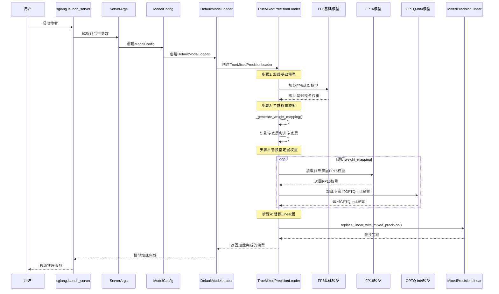
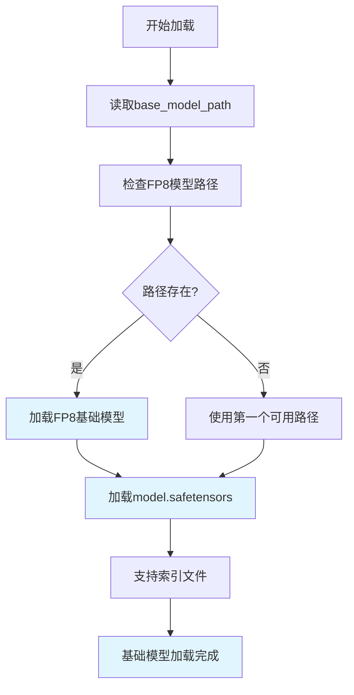
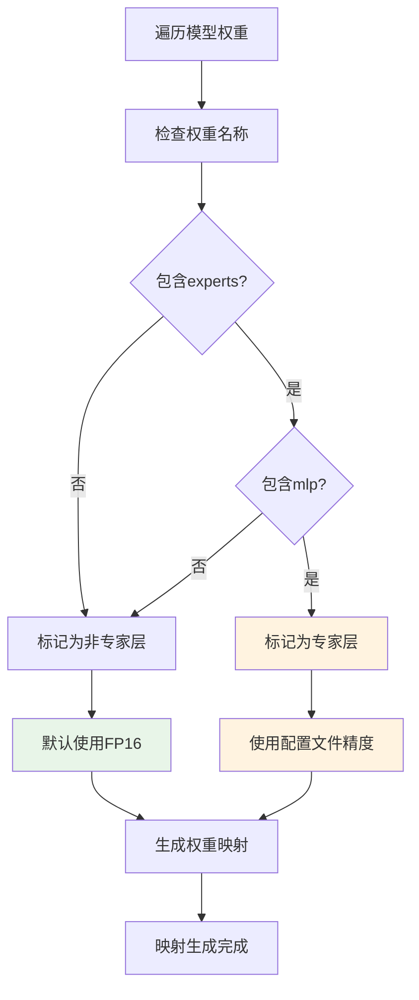
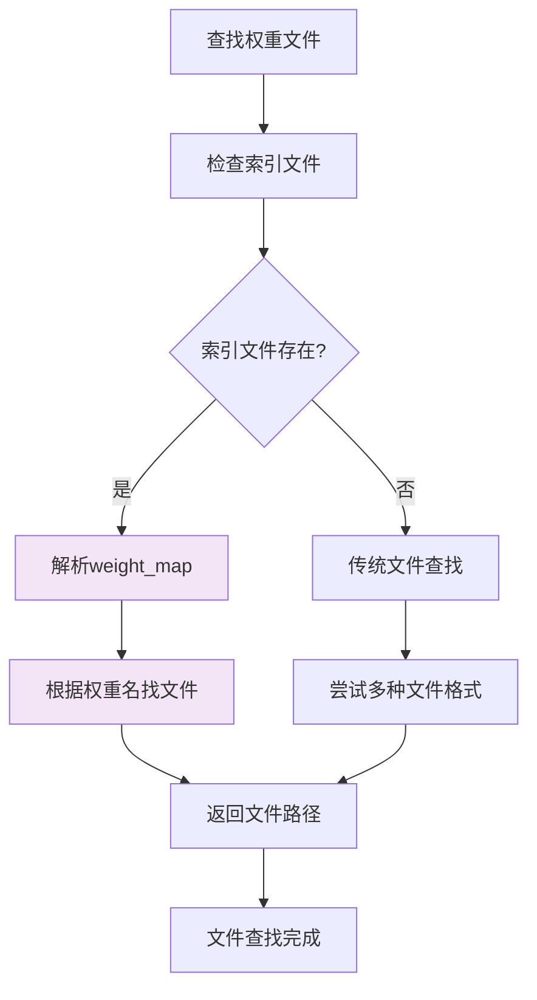
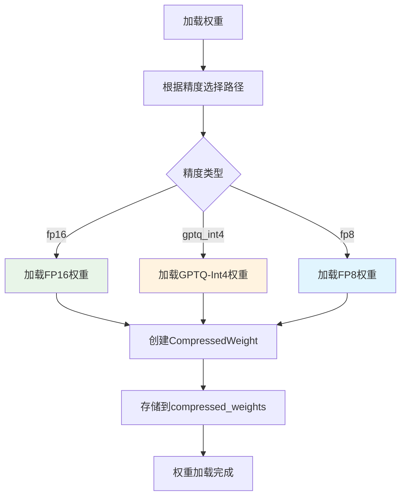
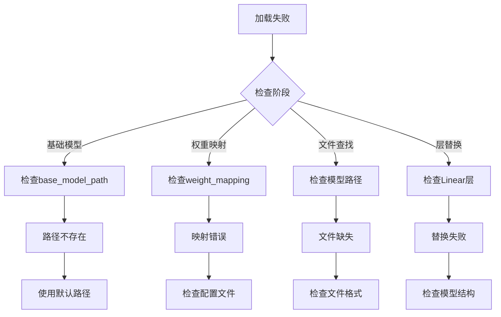

# 混合量化加载时序图

## 完整时序流程



## 不同精度模型加载顺序详解

### 1. 基础模型加载阶段



**加载顺序**: FP8基础模型 → 避免OOM

### 2. 权重映射生成阶段



**映射策略**: 
- 专家层 → 根据配置文件（GPTQ-Int4）
- 非专家层 → 默认FP16

### 3. 权重文件查找阶段



**查找顺序**:
1. 优先使用 `model.safetensors.index.json`
2. 回退到传统文件查找方式

### 4. 权重加载和存储阶段



**加载顺序**:
1. FP16权重（非专家层）
2. GPTQ-Int4权重（专家层）
3. FP8权重（如果配置）

## 具体文件加载顺序

### 基础模型文件加载
```
1. /dcar-vepfs-trans-models/Qwen3-30B-A3B-FP8/
   ├── model.safetensors.index.json (优先)
   ├── model.safetensors
   └── pytorch_model.bin (回退)
```

### 不同精度权重文件加载
```
2. /dcar-vepfs-trans-models/Qwen3-30B-A3B/ (FP16)
   ├── model.safetensors.index.json
   ├── model.safetensors
   └── pytorch_model.bin

3. /dcar-vepfs-trans-models/Qwen3-30B-A3B-GPTQ-Int4/ (GPTQ-Int4)
   ├── model.safetensors.index.json
   ├── model.safetensors
   └── pytorch_model.bin
```

## 内存使用时间线

```mermaid
gantt
    title 混合量化内存使用时间线
    dateFormat X
    axisFormat %s
    
    section 基础模型加载
    FP8基础模型    :0, 5s
    section 权重映射生成
    生成映射       :5s, 6s
    section 权重替换
    FP16权重加载   :6s, 8s
    GPTQ权重加载   :6s, 8s
    section 层替换
    Linear层替换   :8s, 9s
    section 推理服务
    服务启动       :9s, 10s
```

## 关键时间点说明

### T0-T5: 基础模型加载
- **内存使用**: 低（FP8格式）
- **主要操作**: 加载FP8基础模型
- **目的**: 避免OOM，建立模型结构

### T5-T6: 权重映射生成
- **内存使用**: 无额外内存
- **主要操作**: 分析模型结构，生成映射
- **目的**: 确定每个权重的精度策略

### T6-T8: 权重替换
- **内存使用**: 逐步增加
- **主要操作**: 加载不同精度权重
- **目的**: 替换指定层为高精度权重

### T8-T9: 层替换
- **内存使用**: 保持稳定
- **主要操作**: 替换Linear层
- **目的**: 启用动态反量化

### T9+: 推理服务
- **内存使用**: 按需反量化
- **主要操作**: 处理推理请求
- **目的**: 高效推理

## 优化策略总结

### 1. 内存优化
- **基础模型**: FP8格式，减少50%内存
- **压缩存储**: 保持压缩格式，不立即反量化
- **按需处理**: 推理时动态反量化

### 2. 加载优化
- **索引文件**: 快速定位权重文件
- **缓存机制**: 避免重复加载
- **并行加载**: 支持多文件并行加载

### 3. 精度平衡
- **关键层**: 使用FP16保持精度
- **专家层**: 使用Int4节省内存
- **灵活配置**: 根据需求调整精度

## 故障排除时间线



这个时序图清晰地展示了混合量化从启动到推理的完整流程，以及不同精度模型的加载顺序和内存使用情况。
